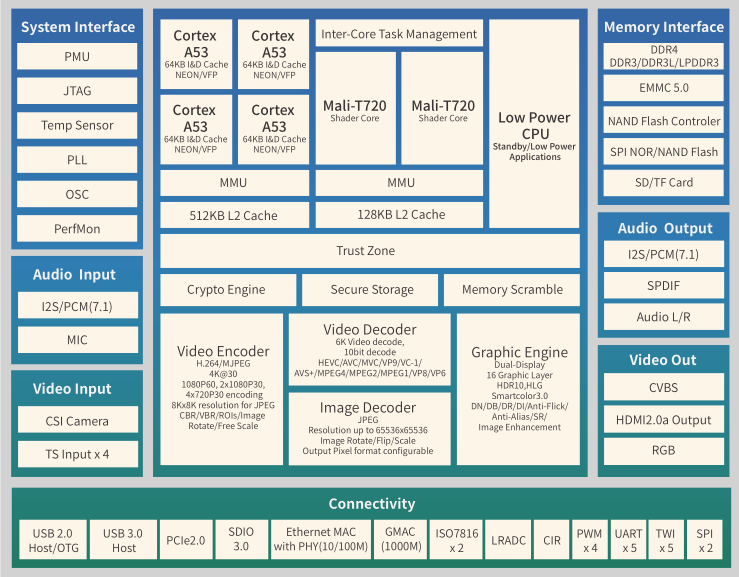

# [H6](https://github.com/mcuyun/H6) 

#### 归属：[cortex A53系列](https://github.com/mcuyun/CA53)
#### [关于悠云](https://github.com/mcuyun)可访问 www.mcuyun.com

## [描述](https://github.com/mcuyun/H6/wiki) 

A53四核，28nm工艺，侧重高清显示4K画质，接口丰富

主要特点：PCIe 2.0 , USB 3.0 

功能特点：HDMI && mali-T720MP2

主要短板：图像和音频输入

器件封装：BGA451 (15mm x 15mm, 0.65mm/0.3mm pitch) 

参考价格：48元

#### [docs](docs/README.md)

参考设计和数据手册

---

###  [悠云，为嵌入式](http://www.mcuyun.com)   
###  qitas@qitas.cn
